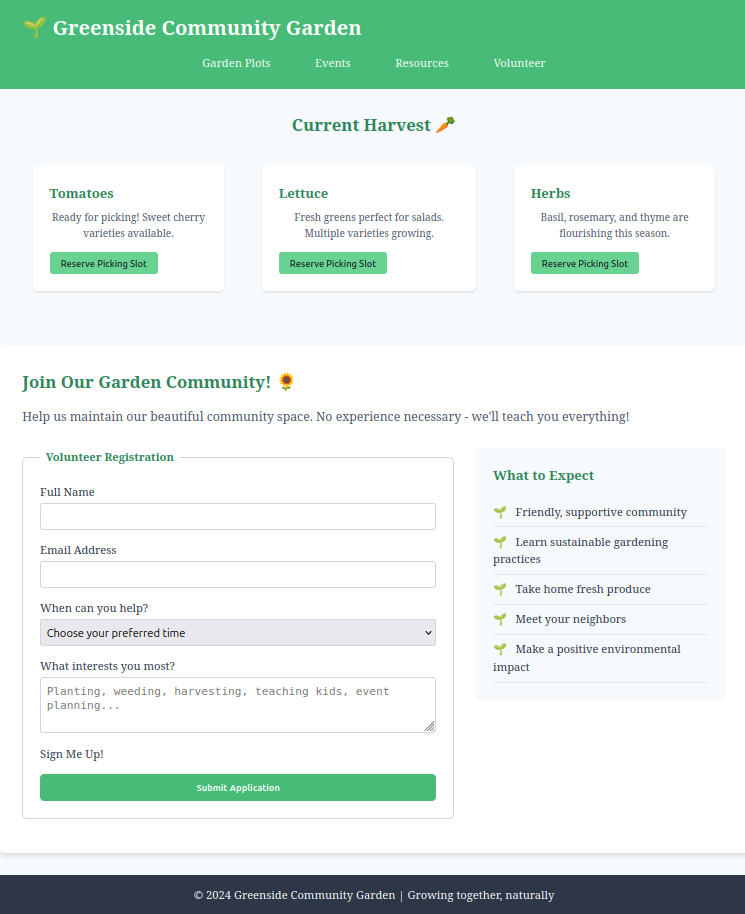
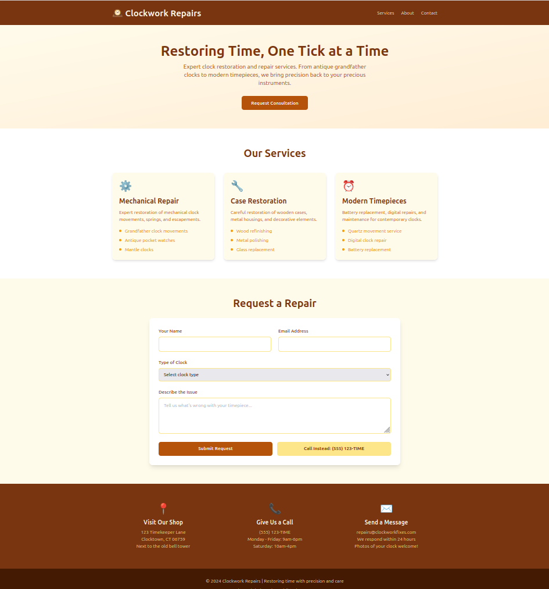
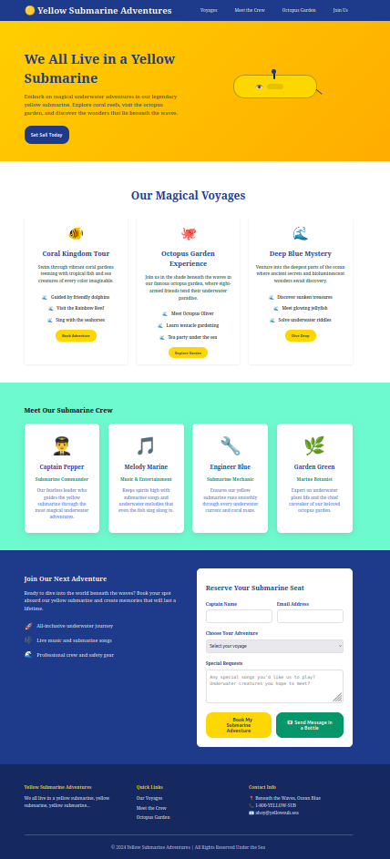

# CSS Frameworks Debugging Lab

**Time Estimate:** 3.5-4 hours  
**Concepts:** CSS Fundamentals, Tailwind CSS, SASS/SCSS  
**Focus:** Debugging, Integration, Best Practices

## Overview

Welcome to the CSS Frameworks Debugging Lab! This lab reinforces fundamental CSS concepts and framework-specific best practices through hands-on debugging challenges.

You'll work through three distinct sections, each representing a different approach to styling web projects:

1. **Vanilla CSS** (60-80 min) - Community Garden theme
2. **Tailwind CSS** (60-80 min) - Clock Repair Shop theme  
3. **SASS/SCSS** (60-80 min) - Yellow Submarine theme

Each section contains both **diagnostic fixes** (specific broken code to debug) and **qualitative improvements** (creative enhancements to make the sites better).

## Learning Objectives

By completing this lab, you will:

- **Strengthen CSS fundamentals** through debugging real-world issues
- **Gain familiarity** with popular CSS approaches and tools
- **Build confidence** with command-line tools and build processes
- **Practice problem-solving** with immediate feedback through automated tests
- **Connect concepts** you've learned across multiple weeks

## Lab Structure

### Section 1: Vanilla CSS Debugging (~60 minutes)
**Theme:** 🌱 Community Garden Website

**What you'll do:**
- Fix 10 diagnostic CSS issues (broken properties, missing units, specificity conflicts)
- Improve the volunteer form design with qualitative enhancements
- Practice core CSS concepts: flexbox, grid, positioning, specificity

**Key Skills:**
- CSS property names and syntax
- Box model and layout debugging
- Specificity and cascade understanding

---

### Section 2: Tailwind CSS Setup & Debugging (~60 minutes)  
**Theme:** 🕰️ Clock Repair Shop Website

**What you'll do:**
- **Setup Phase (30 min):** Configure Tailwind CSS build process with detailed guidance
- **Diagnostic Phase (30 min):** Fix 10 broken Tailwind utility classes
- Learn utility-first CSS approach through hands-on practice

**Key Skills:**
- Package management with npm
- CSS build processes and watch commands
- Utility-first CSS methodology
- Command line comfort building
  
---

### Section 3: SASS Debugging & Organization (~60 minutes)
**Theme:** 🟡 Yellow Submarine Adventures Website

**What you'll do:**
- Fix 10 SASS syntax and compilation issues (variables, mixins, functions, imports)
- Improve code organization with qualitative SASS features
- Learn CSS preprocessing benefits through practical application

**Key Skills:**
- SASS/SCSS syntax and compilation
- CSS organization with variables, mixins, and functions
- Advanced CSS features and preprocessing benefits

## Getting Started

### Quick Start
1. Navigate to the `lab/` directory
2. Follow the detailed instructions in `lab/README.md`
3. Install dependencies with `npm install`
4. Work through each section sequentially

## Learning Outcomes

After completing this lab, you should feel confident:

- **Debugging CSS issues** systematically and efficiently
- **Understanding different CSS approaches** and when to use them
- **Working with build tools** and command-line processes  
- **Organizing CSS code** for maintainability and scalability
- **Connecting fundamental concepts** across different tools and frameworks

---

**Happy debugging! 🐛→✨**

*This lab is designed to build confidence through hands-on problem-solving while reinforcing fundamental concepts that will serve you throughout your web development journey.*
